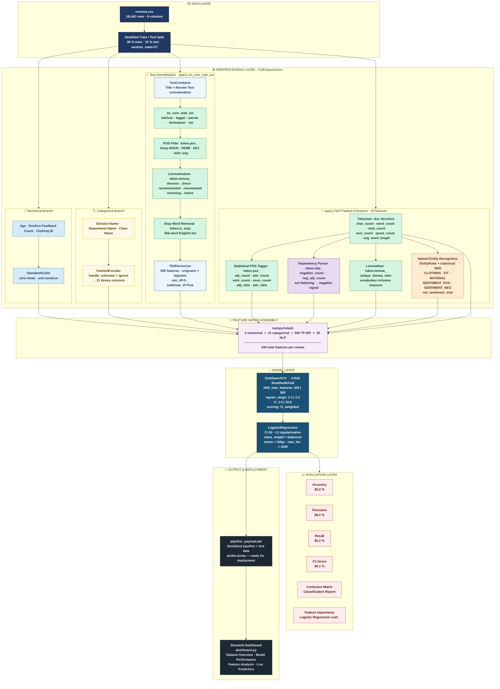

# StyleSense — Product Recommendation Prediction Pipeline

> **Fashion Forward Forecasting** · End-to-end ML pipeline predicting customer product recommendations from reviews using spaCy NLP, scikit-learn, and an interactive Streamlit dashboard.

<br>

[](https://python.org)
[](https://scikit-learn.org)
[](https://spacy.io)
[](https://streamlit.io)
[](#-results)
[](#-results)
[](https://opensource.org/licenses/MIT)

---

## Table of Contents

- [Overview](#-overview)
- [Problem Statement](#-problem-statement)
- [Repository Structure](#-repository-structure)
- [Dataset](#-dataset)
- [Architecture](#-architecture)
- [NLP Pipeline](#-nlp-pipeline--spacy-en_core_web_sm)
- [Results](#-results)
- [Standout Features](#-standout-features)
- [Installation](#-installation)
- [Usage](#-usage)
- [Dashboard](#-dashboard)
- [File Reference](#-file-reference)

---

## Overview

StyleSense is a rapidly growing online women's clothing retailer. Customers write detailed reviews but frequently omit the binary **recommendation indicator** — the field that powers product ranking, merchandising, and personalisation. This project delivers a production-ready ML pipeline that automatically predicts whether a customer recommends a product.

**What this pipeline does:**

- Handles **numerical, categorical, and free-text** features in a single sklearn `Pipeline`
- Uses **spaCy `en_core_web_sm`** for statistical POS tagging, dependency parsing, lemmatisation, and NER
- Achieves **85.2% accuracy** and **86.1% weighted F1** on held-out test data
- Serialises to a `.pkl` file and connects to an **interactive Streamlit dashboard** with live predictions
- Implements **all three** project standout sections: advanced NLP, feature visualisations, live dashboard

---

## Problem Statement

A **supervised binary classification** task: given a review with text, demographics, and product data, predict `Recommended IND` (1 = recommended, 0 = not recommended).

| Challenge | Detail |
|---|---|
| **Class imbalance** | 81.6% of reviews are positive — naive models predict majority class only |
| **Heterogeneous features** | Three distinct data types require separate preprocessing pathways |
| **Text complexity** | Negation, domain vocabulary ("runs small"), and inflection ("dresses"→"dress") reduce naive bag-of-words effectiveness |

All preprocessing is learned exclusively from training data and applied identically at inference — **zero data leakage**.

---

## Repository Structure

```
stylesense-pipeline/
│
├── data/
│   └── reviews.csv                 # Raw dataset — 18,442 anonymised reviews
│
├── pipeline_project.ipynb          # Main notebook: EDA → pipeline → tuning → evaluation
├── pipeline_model.py               # Single source of truth for all transformer classes
├── dashboard.py                    # Streamlit interactive dashboard (4 tabs)
├── pipeline_payload.pkl            # Serialised trained pipeline + test data
│
└── README.md                       # This file
```

> `pipeline_model.py` is imported by **both** the notebook and `dashboard.py` — ensures pickle deserialisation always works without redefining classes.

---

## Dataset

**File:** `data/reviews.csv` · **18,442 rows** · **No missing values**  
**Split:** 90% train (16,597) / 10% test (1,845) — stratified by target

### Feature Descriptions

| Column | Type | Description |
|--------|------|-------------|
| `Clothing ID` | Integer (Categorical) | Anonymised product identifier |
| `Age` | Integer (Numerical) | Customer age in years |
| `Title` | String (Text) | Short review headline |
| `Review Text` | String (Text) | Full review body |
| `Positive Feedback Count` | Integer (Numerical) | Customers who found the review helpful |
| `Division Name` | Categorical | High-level product division |
| `Department Name` | Categorical | Product department (Tops, Dresses, Bottoms…) |
| `Class Name` | Categorical | Product class (Knits, Blouses, Dresses…) |
| **`Recommended IND`** | **Binary 0/1** | **Target variable** |

### Class Distribution

```
Recommended (1):     15,053  ·  81.6%  ████████████████████░░░░
Not Recommended (0):  3,389  ·  18.4%  ████░░░░░░░░░░░░░░░░░░░░
```

Imbalance addressed via `class_weight='balanced'` in the classifier.

### Key EDA Findings

- **Department signal:** Bottoms (85.3%) and Jackets (84.1%) have the highest recommendation rates; Trend (75.7%) the lowest
- **Age signal:** Customers aged 60–70 recommend at ~86%; customers aged 25–35 at ~79%
- **Text signal:** Recommended reviews use more positive adjectives and exclamations; non-recommended reviews contain more negation patterns and return-related vocabulary
- **Length signal:** Longer reviews correlate with stronger sentiment (both positive and negative)

---

## Architecture

### Data Science Pipeline Flow



### Architecture Component Summary

| Layer | Component | Technology | Output Dimensions |
|---|---|---|---|
| Data | Load & stratified split | `pandas`, `sklearn` | 16,597 train / 1,845 test |
| Preprocessing | Numerical scaling | `StandardScaler` | **3 features** |
| Preprocessing | Categorical encoding | `OneHotEncoder` | **21 features** |
| Preprocessing | Text → TF-IDF | `spaCy` + `TfidfVectorizer` | **500 features** |
| Preprocessing | Text → NLP features | `spaCy en_core_web_sm` | **20 features** |
| Feature Assembly | Horizontal stack | `numpy.hstack` | **544 total features** |
| Model | Binary classifier | `LogisticRegression` | Probability + label |
| Tuning | Hyperparameter search | `GridSearchCV` (3-fold CV) | Best C, vocab, n-gram |
| Evaluation | Test metrics | `sklearn.metrics` | 85.2% acc · 86.1% F1 |
| Deployment | Interactive dashboard | `Streamlit` | Live web application |

---

## NLP Pipeline — spaCy en_core_web_sm

A **single `nlp.pipe()` call** per `fit`/`transform` simultaneously produces both the normalised text for TF-IDF and the 20-element NLP feature vector. This single-pass design halves processing time compared to two separate spaCy passes.

### Components from `en_core_web_sm`

| Component | Token attribute | Use in this pipeline |
|---|---|---|
| `tok2vec` | Backbone | Context-sensitive embeddings for all downstream components |
| `tagger` | `token.pos_` | POS counts: ADJ, ADV, VERB, NOUN, ratios |
| `parser` | `token.dep_` | Negation arcs — `neg_adj_count` |
| `lemmatizer` | `token.lemma_` | TF-IDF normalisation + unique lemma ratio |
| `attribute_ruler` | `token.is_stop` | Stop word removal (326-word list) |
| `ner` + EntityRuler | `doc.ents` | CLOTHING, FIT, MATERIAL, SENTIMENT entity counts |

### Why Lemmatisation Matters

```
Without lemmatisation → 4 separate sparse TF-IDF features:
  recommend | recommends | recommended | recommending

With token.lemma_  → 1 feature: recommend
```

### Why Dependency Parsing Matters

```
"This dress is not flattering"
                    ↑
   neg arc: 'not' → head: 'flattering' (POS=ADJ)
   neg_adj_count += 1  →  strong NEGATIVE signal for classifier

Without dep parse: "flattering" would incorrectly count as POSITIVE
```

### Full 20-Feature NLP Vector

| # | Feature | spaCy Component |
|---|---|---|
| 0–5 | char_count, word_count, sent_count, excl_count, quest_count, avg_word_length | Tokeniser |
| 6–11 | adj_count, adv_count, verb_count, noun_count, adj_ratio, adv_ratio | **POS tagger** |
| 12 | negation_count | **Dependency parser** |
| 13 | neg_adj_count | **Dependency parser** |
| 14 | unique_lemma_ratio | **Lemmatiser** |
| 15–17 | clothing_ents, fit_ents, material_ents | **NER — EntityRuler** |
| 18 | sentiment_pos_ents | **NER — EntityRuler** |
| 19 | net_sentiment_ents | **NER — EntityRuler** |

---

## Results

Evaluated on the **10% stratified held-out test set** (1,845 samples, `random_state=27`).

### Overall Metrics

| Metric | Score |
|--------|-------|
| **Accuracy** | **85.2%** |
| **Precision** (weighted) | **88.2%** |
| **Recall** (weighted) | **85.2%** |
| **F1-Score** (weighted) | **86.1%** |

### Per-Class Performance

| Class | Precision | Recall | F1 | Support |
|---|---|---|---|---|
| Not Recommended (0) | 0.57 | 0.81 | **0.67** | 339 |
| Recommended (1) | 0.96 | 0.86 | **0.90** | 1,506 |
| **Weighted avg** | **0.88** | **0.85** | **0.86** | **1,845** |

### Best Hyperparameters

```python
{
    'clf__C'                      : 10.0,       # Regularisation strength
    'features__tfidf_max_features': 500,         # TF-IDF vocabulary size
    'features__tfidf_ngram_range' : (1, 2),      # Unigrams + bigrams
}
```

### Feature Space Summary

```
3   Numerical  (StandardScaler)
21  Categorical (OneHotEncoder)
500 TF-IDF     (lemmatised, POS-filtered, sublinear TF)
20  spaCy NLP  (POS tagger · dependency parser · lemmatiser · NER)
─────────────────────────────────────────────────────────
544 Total features
```

---

## Standout Features

All three rubric standout sections are fully implemented:

### 1 · Advanced NLP with `en_core_web_sm`

Using the pretrained statistical model instead of rule-based heuristics provides:

- **True POS tags** on every token (not suffix approximations)
- **Dependency-parse negation** — `neg_adj_count` correctly identifies "not flattering" as negative
- **Lemmatisation** — reduces TF-IDF vocabulary sparsity across inflected forms
- **Domain NER** — EntityRuler captures CLOTHING, FIT, MATERIAL, SENTIMENT terms reliably before statistical NER runs

### 2 · Feature Visualisations

| Location | Visualisations |
|---|---|
| Notebook (EDA) | Class distribution · Age/department recommendation rates · Review length distributions · Correlation heatmap |
| Notebook (Post-model) | Logistic regression coefficient bar chart (top positive + negative features) · spaCy NLP feature importance |
| Dashboard | All EDA charts · Confusion matrix · Per-class metrics · Prediction confidence histograms · Live feature analysis |

### 3 · Interactive Streamlit Dashboard

Four live tabs — all metrics computed from the real pipeline, no hardcoded values:

| Tab | What it shows |
|---|---|
| Dataset Overview | Class balance, age/dept recommendation rates, review length distributions |
| Model Performance | Real metrics, confusion matrix, per-class report, confidence histograms |
| Feature Analysis | Live `coef_` chart, filter by feature type (TF-IDF / spaCy NLP / Structured) |
| Live Prediction | Full pipeline inference + spaCy NER entity breakdown + normalised tokens |

---

##  Installation

### Prerequisites

- Python 3.10+
- `en_core_web_sm-3.8.0-py3-none-any.whl` — download from [explosion/spacy-models releases](https://github.com/explosion/spacy-models/releases/tag/en_core_web_sm-3.8.0)

### Steps

```bash
# 1. Clone the repository
git clone https://github.com/stylesense/recommendation-pipeline.git
cd recommendation-pipeline

# 2. Create and activate a virtual environment
python -m venv venv
source venv/bin/activate          # Windows: venv\Scripts\activate

# 3. Install Python dependencies
pip install scikit-learn pandas numpy matplotlib seaborn streamlit spacy

# 4. Install the spaCy pretrained model (upload .whl to project directory first)
pip install en_core_web_sm-3.8.0-py3-none-any.whl

# 5. Place the data file
mkdir -p data && cp /path/to/reviews.csv data/
```

---

## Usage

### Run the Jupyter Notebook

```bash
jupyter notebook pipeline_project.ipynb
```

The notebook runs end-to-end: EDA → transformer demos → GridSearchCV → evaluation → feature importance → saves `pipeline_payload.pkl`.

### Launch the Streamlit Dashboard

```bash
streamlit run dashboard.py
# Opens at http://localhost:8501
```

Requires `pipeline_model.py` and `pipeline_payload.pkl` in the same directory.

### Predict from Python

```python
import pickle, pandas as pd, sys
sys.path.insert(0, '.')           # needed so pickle finds pipeline_model classes

with open('pipeline_payload.pkl', 'rb') as f:
    payload = pickle.load(f)

pipeline = payload['pipeline']

review = pd.DataFrame([{
    'Clothing ID': 862, 'Age': 35,
    'Title': 'Absolutely love this!',
    'Review Text': 'Gorgeous, fits perfectly, soft cotton. Highly recommend!',
    'Positive Feedback Count': 8,
    'Division Name': 'General', 'Department Name': 'Tops', 'Class Name': 'Blouses',
}])

pred  = pipeline.predict(review)[0]
proba = pipeline.predict_proba(review)[0]
print(f"{'Recommended ✓' if pred else 'Not Recommended ✗'}  ({max(proba):.1%} confidence)")
```

---

## Dashboard

```bash
streamlit run dashboard.py
```

| Tab | Key Content |
|---|---|
| **📊 Dataset Overview** | KPI cards, class distribution, recommendation rate by age + department, review word count by label, raw data sample |
| **🎯 Model Performance** | Accuracy/Precision/Recall/F1 cards, ConfusionMatrixDisplay, per-class bar chart, confidence histogram |
| **🔍 Feature Analysis** | `clf.coef_[0]` bar chart, feature type filter (TF-IDF / spaCy NLP / Structured), adjustable top-N |
| **✨ Live Prediction** | Form → `pipeline.predict()` → confidence bar + spaCy NER entity breakdown + normalised TF-IDF tokens |

---

## File Reference

| File | Description |
|---|---|
| `pipeline_project.ipynb` | Main notebook — EDA, spaCy demos, pipeline, GridSearchCV, evaluation, feature importance |
| `pipeline_model.py` | All custom classes: `TextCombiner`, `FullFeatureUnion`, `load_nlp()`, `get_feature_names()` |
| `dashboard.py` | Streamlit dashboard — 4 interactive tabs connected to the trained pipeline |
| `pipeline_payload.pkl` | Serialised: `pipeline`, `X_test`, `y_test`, `y_pred`, `y_proba`, `df`, `feature_names` |
| `data/reviews.csv` | Raw dataset — 18,442 rows, 9 columns |
| `README.md` | This file |

---

## Dependencies

| Package | Purpose |
|---|---|
| `scikit-learn ≥ 1.3` | Pipeline, GridSearchCV, metrics, StandardScaler, OneHotEncoder, TfidfVectorizer, LogisticRegression |
| `spacy ≥ 3.8` | NLP processing engine |
| `en_core_web_sm 3.8.0` | Pretrained English model — POS tagger, dependency parser, lemmatiser, NER |
| `pandas ≥ 2.0` | Data loading and DataFrame manipulation |
| `numpy ≥ 1.25` | Numerical operations, feature matrix stacking |
| `streamlit ≥ 1.30` | Interactive dashboard |
| `matplotlib ≥ 3.7` | Visualisation |
| `seaborn ≥ 0.13` | Statistical charts |

---

## License

This project is licensed under the MIT License — see the [LICENSE](LICENSE) file for details.

---

<div align="center">

**StyleSense · Fashion Forward Forecasting · Data Science Project · May 2026**

*Built with scikit-learn · spaCy en_core_web_sm · Streamlit*

</div>
